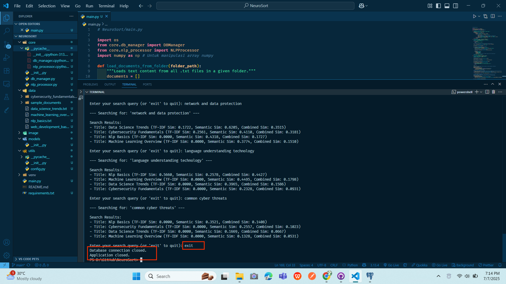

# 🧠 NeuroSort — Klasifikasi & Pencarian Dokumen Cerdas Berbasis AI Lokal

**NeuroSort** adalah aplikasi AI lokal yang dapat membaca, memahami, mengklasifikasikan, dan mencari dokumen berbasis isi langsung dari komputer pribadi, tanpa koneksi internet, tanpa API key, dan tanpa risiko privasi.

---

## 🎯 Tujuan Utama

NeuroSort hadir untuk membantu pengguna menemukan dokumen penting dengan cepat dan cerdas menggunakan teknologi NLP dan machine learning.  
Tidak perlu lagi menebak nama file atau lokasi folder—cukup ketik apa yang ingin ditemukan, dan NeuroSort akan mencarikannya berdasarkan isi.

---

## ⚙️ Teknologi Inti

- **Python 3.10+**
- **spaCy** untuk NLP
- **scikit-learn (TF-IDF)** untuk representasi isi dokumen
- **PostgreSQL + SQLAlchemy** untuk penyimpanan data
- **Streamlit** (opsional) untuk antarmuka visual

---

## 🔄 Cara Kerja Program

1. 📂 **Pemindaian Dokumen Lokal**  
   Sistem membaca semua file `.txt`, `.pdf`, dan `.docx` dari folder `data/sample_documents/`.

2. 🧹 **Preprocessing Teks**  
   - Tokenisasi kata dan kalimat menggunakan spaCy  
   - Menghapus stopwords, simbol, dan kata tidak penting

3. 🧠 **Klasifikasi & Pemberian Label Otomatis**  
   - Menggunakan TF-IDF untuk memahami konteks isi  
   - Sistem menentukan label/kategori dokumen secara otomatis

4. 🔍 **Pencarian Kontekstual**  
   - Ketika pengguna mengetik query seperti “language understanding technology”, sistem akan mencocokkan konten dokumen dengan query  
   - Mengembalikan hasil berdasarkan skor kemiripan (cosine similarity)

5. 🗂️ **Penyimpanan Metadata ke PostgreSQL**  
   Semua informasi—judul, isi, label, skor pencarian, tanggal dibaca—disimpan untuk efisiensi akses di masa mendatang.

---

## 🔍 Contoh Pencarian & Hasil yang Diharapkan

| 💬 Query                          | 🔎 Hasil yang Diharapkan                                                                 |
|----------------------------------|------------------------------------------------------------------------------------------|
| **artificial intelligence concepts**  | Dokumen seperti *NLP Basics*, *Machine Learning Overview* akan muncul teratas            |
| **data analysis techniques**         | Dokumen tentang *Data Science*, *Machine Learning*                                       |
| **website development guide**       | Dokumen seperti *Web Development Basics* paling relevan                                  |
| **network and data protection**     | *Cybersecurity Fundamentals* akan jadi prioritas utama                                   |
| **language understanding technology** | *NLP Basics* harus muncul paling relevan                                                 |
| **common cyber threats**            | *Cybersecurity Fundamentals* akan muncul kembali di posisi teratas                       |

---

## 🖼️ Visualisasi Program

| Tahapan | Gambar |
|--------|--------|
| 💡 Konsep Kecerdasan Buatan |  |
| 🔠Proses Perubahan & Ekstraksi |  |
| 🧠 Arsitektur Pemrosesan |  |
| 📊 Teknik Analisis Data |  |
| 🗃️ Struktur Database |  |
| 🚪 Keluar atau Simpan Hasil |  |
| 🌠Pemahaman Bahasa |  |
| 🔠Jaringan & Proteksi Data |  |
| 📋 Tampilan Isi Tabel PostgreSQL |  |
| 🌠Panduan Pengembangan Web |  |

---

> 💡 Proyek ini dirancang agar dapat menarik perhatian perusahaan besar seperti Google, dengan pendekatan **AI praktis**, **arsitektur modular**, dan **pengolahan data cerdas yang menjaga privasi pengguna sepenuhnya.**

